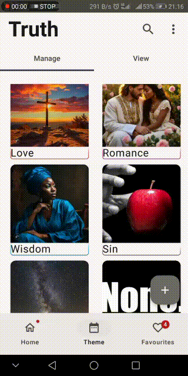

# Sword
Sword is an app that can be used to keep track of memorised Bible verses with features like memorise today, dynamic theming based on the last verse selected,beautiful UI and interesting little features that make memorising Bible verses fun

It's still in the works, hopefully I can complete it before the year ends

### SWORD Demo

### SWORD Demo

